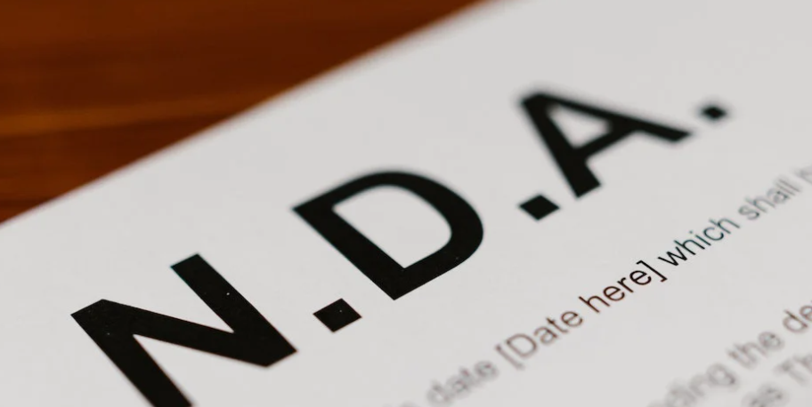
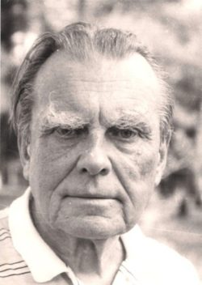

Przedstawiam fragmenty z niektórych moich tłumaczeń z polskiego na angielski:

---

(1) Symbolika sprężyny w pełni wyraża ...|{: width="120" height="90" style="display: block; margin: auto"}
---------|---------
Symbolika sprężyny w pełni wyraża charakter i energię Polaków. Nasze niepokorne, ale jednocześnie konstruktywne podejście do świata. Im bardziej, jako naród, byliśmy ograniczani, tym większą energię, i twórcze napięcie generowaliśmy. Odradzaliśmy się silniejsi i jeszcze dynamiczniej działaliśmy. Okres 25 lat wolności udowodnił, że uwolniona energia pobudza nas do konstruktywnego i innowacyjnego działania. Polacy zawsze próbowali osiągać to, co wydawałoby się niemożliwe, nie akceptując zastanego status quo. Polska zasila, nową energią, świeżymi pomysłami, przeżyciami i zaangażowaniem.|The symbol of a spring fully expresses Poles' personality and energy, as well as our defiant, but, at the same time, constructive attitude to the world around us. The more someone tried to control us as a nation, the more energy and creative tension we generated, the stronger we became and the more dynamically we acted. Those 25 years of freedom have shown that releasing that energy makes us constructive and innovative. Poles have always tried to achieve what was seemingly impossible and have never accepted the existing status quo. Poland is full of energy, has fresh ideas, has been enriched by her experiences and is passionate about whatever she does.
 | 
 | 

<!--(2) Umowa o poufności|{: width="120" height="90" style="display: block; margin: auto"}
---------|---------
Za ważne przyczyny w rozumieniu niniejszej umowy, strony rozumieją między innymi:|In this agreement, 'cause' shall include but not be limited to:
 ... naruszenie przez Stronę umowy lub też personel Zleceniobiorcy obowiązku utrzymania w tajemnicy wszelkich informacji związanych i/lub otrzymanych w związku z wykonaniem niniejszej umowy.| … a breach of the agreement by either Party or a breach of the duty on the part of the Contractor’s personnel to maintain the confidentiality of all the information relating to and/or received in connection with the performance of this contract.
 | 
 | -->

(2) Agile w praktyce|{: width="240" height="270" style="display: block; margin: auto"}
---------|---------
... Wynika z tego, że choć w swych założeniach i praktyce podejścia te są od siebie bardzo różne to w praktyce organizacyjnej wykorzystuje się oba te podejścia zależnie od kontektu i sytuacji. Warto posłużyć się tutaj określeniem 'dynamiczne sterowanie' - cele wyznaczamy planując, przewidując, natomiast osiągamy je dynamicznie reagując na zmieniające się warunki.|... The reason for this is that, although the predictive approach and empirical approach are completely different both in theory and in practice, in the real-world, both approaches are used depending on the actual context and situation. Used together, we can talk of 'dynamic control' as follows: we specify our goals by planning and predicting; but we implement our goals by reacting dynamically to changes in the surrounding context.
Dobrym modelem mentalnym może być przykładowo wycieczka piesza. Decyzje o wycieczce, jej celu i ogólnej trasie podejmujemy zawczasu, predykcyjnie. Jednak realizujemy ją nie w oparciu o szczegółową mapę pokazującą jak postawić każdy kolejny krok, lecz przeciwnie reagując na napotkaną rzeczywistość (np. zamknięte przejście, opad deszczu, spóźniony autobus) wciąż jednak dążąc do strategicznego celu. Podobnie wygląda sterowanie organizacjami, z tą różnicą, że w odróżnieniu od wycieczki również cel może się zmienić zależnie od warunków.|A good analogy for this is the act of going for a walk. We use the predictive approach (in advance) to decide to go on a walk, to define its end point and to plan the general route. Although it is true that we carry out the walk by following details on a map which shows us where to go at every step, nevertheless we may have to react to whatever we meet along the way (for example, the fact that a path has been closed, that it starts to rain or that the bus is late) in order to achieve our (strategic) goal. Organizations can be steered in the same way, although, in their case the goal to be attained may change over time as the surrounding context changes.
W każdym przypadku jednak - zarówno „makro” jak i „mikro” należy traktować predykcje jako li tylko prognozy rzeczywistości, prognozy, które jesteśmy w stanie w każdej chwili odrzucić lub zrewidować reagując na zmiany w rzeczywistości. Innymi słowy predykcja jest pożyteczna, o ile jest empirycznie weryfikowana i zmieniana. ...|In any case, whether we are using the predictive approach at a level of abstraction which is “macro” or “micro”, it is important to understand that we are, in effect, merely predicting a certain reality and, later, we can throw away that prediction completely or change it to some degree in order to react to the reality which we actually encounter. In other words, the predictive approach is useful only in so far as its results are verified empirically and then changes are made as appropriate. ...
 | 
 | 

(3) Długo uczyłem się Łodzi ...|{: width="160" height="120" style="display: block; margin: auto"}
---------|---------
Długo uczyłem się Łodzi, aż zrozumiałem, że ten konglomerat magicznych podwórek, Księżego Młyna i ulicy Piotrkowskiej, dziewiętnastowiecznych domków na Nawrot to jest pewien zamysł urbanistyczny. Nigdzie indziej w Polsce niespotykany i wyjątkowy.|It took me a long time to really understand the City of Łódź. Finally, I realized that the combination of hidden courtyards, the Księży Młyn factory neighbourhood, Piotrkowska Street and the nineteenth century houses on Nawrot Street has resulted in a particular urban design. This design is unique in Poland and quite exceptional.
Ale zanim to zrozumiałem trwało to długo, nim się z tym zamysłem nie zidentyfikowałem. Łódź może się podobać, bo jest różna. Każda ulica i każda dzielnica to jest inna propozycja przeżywania miasta. Czym innym jest ulica Ogrodowa, a czym innym odległa o sto metrów Manufaktura, mimo że obie oparte są o ten sam rdzeń architektoniczny. Łódź może się podobać ludziom, którzy lubią różnorodność i dobrze się czują wśród zaskoczeń.|And so it took me a long time to understand and fully grasp the concept; Łódź is appealing because it is so diverse. Moving from one street to another (or from one district to another) offers a completely different experience. Ogrodowa Street is quite different from the Manufaktura shopping complex, although they share the same architectural base and are only 100 metres apart. Łódź appeals to those people who like diversity, to those who like to meet something different around every corner.
 | 
 | 

<!--(5) Ani takim to było jak raz się wydało, / Ani takim jak teraz układasz w opowieść ...|{: width="120" height="80" style="display: block; margin: auto"}
---------|---------
... Trudno spoglądać na swą działalność niejako z zewnątrz, czyli nabrać dystansu wobec motywacji i różnorakich uwikłań, z których rodzi się każda twórczość. Ostatecznie bowiem także tekst naukowy jest przecież kreacją jakiegoś mikroświata. ...|... It is not easy to look at one’s own activities from, as it were, the outside, nor to distance oneself from that which one finds motivating and the various influences on all creative work. Ultimately, writing a scientific text means creating some kind of micro-world. ...
 Zatem podejmuję tę opowieść nie bez oporów, choć z zaciekawieniem. Przyświeca mi myśl Paula Ricoeur’a, który mówi, że nasza tożsamość odsłania się dopiero w akcie opowiadania, bo jest po prostu naszą historią (tzw. tożsamość narracyjna). Ale pamiętam też wersy Czesława Miłosza: „Ani takim to było jak raz się wydało, / Ani takim jak teraz układasz w opowieść”. ...|I therefore begin this story not without a feeling of resistance, although I admit to a certain degree of curiosity. I am guided by Paul Ricoeur, who said that our identity is revealed only in the actual act of storytelling (so called narrative identity) because, put simply, this is our story. But I also recall the following verses by Czesław Miłosz: "Neither was it as it once seemed, / Nor is it as you tell it in your story now." ...
 | 
 | -->
 
---

----|----|----|----
[[Oferta](https://smoothenglish.com)] | [[Opinie](../pages/opinie.html)] | _Moja pasja_ | [[Kontakt](../pages/kontakt.html)]