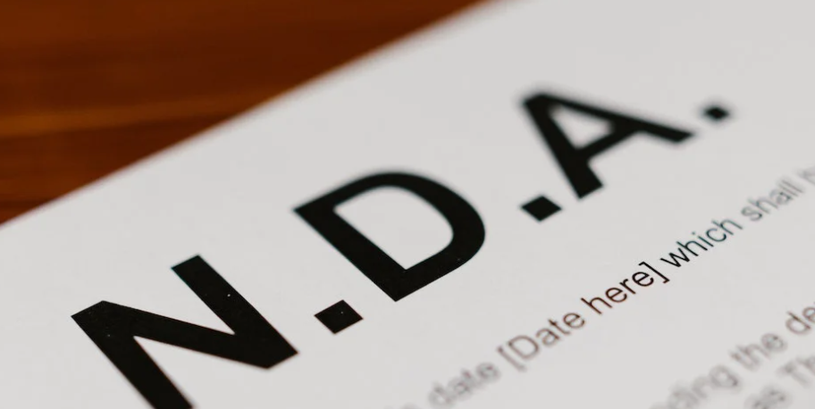

Symbolika sprężyny w pełni wyraża ...|{: width="80" height="60" style="display: block; margin: auto"}
---------|---------
Symbolika sprężyny w pełni wyraża charakter i energię Polaków. Nasze niepokorne, ale jednocześnie konstruktywne podejście do świata. Im bardziej, jako naród, byliśmy ograniczani, tym większą energię, i twórcze napięcie generowaliśmy. Odradzaliśmy się silniejsi i jeszcze dynamiczniej działaliśmy. Okres 25 lat wolności udowodnił, że uwolniona energia pobudza nas do konstruktywnego i innowacyjnego działania. Polacy zawsze próbowali osiągać to, co wydawałoby się niemożliwe, nie akceptując zastanego status quo. Polska zasila, nową energią, świeżymi pomysłami, przeżyciami i zaangażowaniem.|The symbol of a spring fully expresses Poles' personality and energy, as well as our defiant, but, at the same time, constructive attitude to the world around us. The more someone tried to control us as a nation, the more energy and creative tension we generated, the stronger we became and the more dynamically we acted. Those 25 years of freedom have shown that releasing that energy makes us constructive and innovative. Poles have always tried to achieve what was seemingly impossible and have never accepted the existing status quo. Poland is full of energy, has fresh ideas, has been enriched by her experiences and is passionate about whatever she does.
 | 
 | 

Umowa o poufności|{: width="80" height="60" style="display: block; margin: auto"}
---------|---------
Za ważne przyczyny w rozumieniu niniejszej umowy, strony rozumieją między innymi:|In this agreement, 'cause' shall include but not be limited to:
 ... naruszenie przez Stronę umowy lub też personel Zleceniobiorcy obowiązku utrzymania w tajemnicy wszelkich informacji związanych i/lub otrzymanych w związku z wykonaniem niniejszej umowy.| … a breach of the agreement by either Party or a breach of the duty on the part of the Contractor’s personnel to maintain the confidentiality of all the information relating to and/or received in connection with the performance of this contract.
 | 
 | 

Symbolika sprężyny w pełni wyraża ...|{: width="80" height="60" style="display: block; margin: auto"}
---------|---------
Symbolika sprężyny w pełni wyraża charakter i energię Polaków. Nasze niepokorne, ale jednocześnie konstruktywne podejście do świata. Im bardziej, jako naród, byliśmy ograniczani, tym większą energię, i twórcze napięcie generowaliśmy. Odradzaliśmy się silniejsi i jeszcze dynamiczniej działaliśmy. Okres 25 lat wolności udowodnił, że uwolniona energia pobudza nas do konstruktywnego i innowacyjnego działania. Polacy zawsze próbowali osiągać to, co wydawałoby się niemożliwe, nie akceptując zastanego status quo. Polska zasila, nową energią, świeżymi pomysłami, przeżyciami i zaangażowaniem.|The symbol of a spring fully expresses Poles' personality and energy, as well as our defiant, but, at the same time, constructive attitude to the world around us. The more someone tried to control us as a nation, the more energy and creative tension we generated, the stronger we became and the more dynamically we acted. Those 25 years of freedom have shown that releasing that energy makes us constructive and innovative. Poles have always tried to achieve what was seemingly impossible and have never accepted the existing status quo. Poland is full of energy, has fresh ideas, has been enriched by her experiences and is passionate about whatever she does.
 | 
 | 

Symbolika sprężyny w pełni wyraża ...|{: width="80" height="60" style="display: block; margin: auto"}
---------|---------
Symbolika sprężyny w pełni wyraża charakter i energię Polaków. Nasze niepokorne, ale jednocześnie konstruktywne podejście do świata. Im bardziej, jako naród, byliśmy ograniczani, tym większą energię, i twórcze napięcie generowaliśmy. Odradzaliśmy się silniejsi i jeszcze dynamiczniej działaliśmy. Okres 25 lat wolności udowodnił, że uwolniona energia pobudza nas do konstruktywnego i innowacyjnego działania. Polacy zawsze próbowali osiągać to, co wydawałoby się niemożliwe, nie akceptując zastanego status quo. Polska zasila, nową energią, świeżymi pomysłami, przeżyciami i zaangażowaniem.|The symbol of a spring fully expresses Poles' personality and energy, as well as our defiant, but, at the same time, constructive attitude to the world around us. The more someone tried to control us as a nation, the more energy and creative tension we generated, the stronger we became and the more dynamically we acted. Those 25 years of freedom have shown that releasing that energy makes us constructive and innovative. Poles have always tried to achieve what was seemingly impossible and have never accepted the existing status quo. Poland is full of energy, has fresh ideas, has been enriched by her experiences and is passionate about whatever she does.
 | 
 | 

---

----|----|----
[[Oferta](https://smoothenglish.com)] | [[Opinie](../pages/opinie.html)] | [[Kontakt](../pages/kontakt.html)]